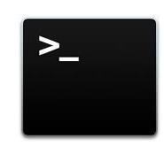
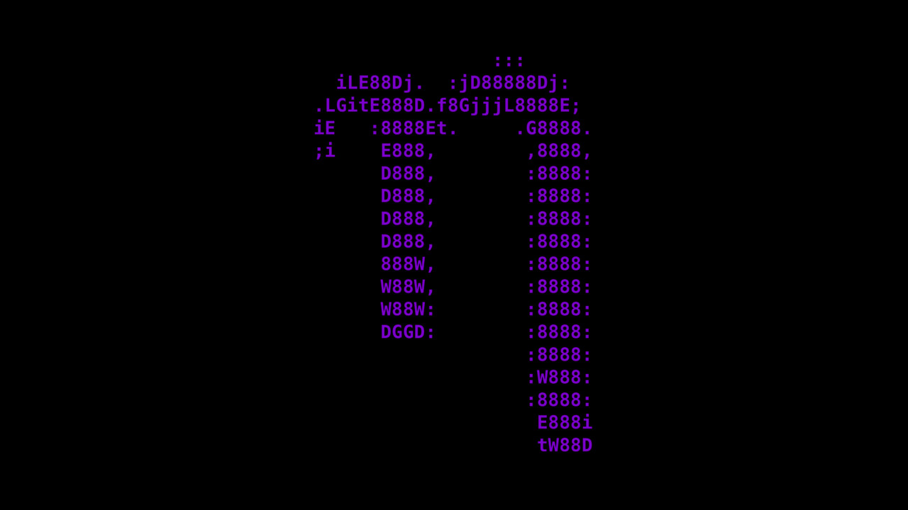

# Linux Terminal Cheatsheet - En

## About the terminal

A **terminal** is a tool which allows users to interact directly with their operating systems through text prompts, rather than a graphic interface.

Here's how it usually works:

* **Inserting the prompt:** You write down a valid command that gives instructions to your system.
* **Processing:** The shell tries to understand the command and execute the corresponding action (copy a file, display a list of directories, etc.)
* **Displays results:** The terminal displays an appropriate response (or error message), according to the command.

  

**Use terminal commands:**  
     1. Open the terminal.  
     2. Write out the prompts.  
     3. See the results.  

## Table of content

* [About the terminal](#about-the-terminal)
* [Table of content](#table-of-content)
* [Terminal](#terminal)
  * [Terminal Shorcuts](#terminal-shortcuts)
  * [Terminal Commands](#terminal-commands)
* [Bash](#bash)
  * [Bash Shortcuts](#bash-shortcuts)
  * [Bash Commands](#bash-commands)
* [Zsh](#zsh)
  * [Zsh Shortcuts](#zsh-shortcuts)
  * [Zsh Commmands](#zsh-commands)
* [Vim](#vim)
  * [Vim Shortcuts](#vim-shortcuts)
* [Nano](#nano)
  * [Nano Shortcuts](#nano-shortcuts)
* [Bash vs Zsh](#bash-vs-zsh)
  * [Bash](#about-bash)
    * [Introduction](#bash-bourne-again-shell-introduction)
    * [Strong Points](#bash-strong-points)
    * [Weak Points](#bash-weak-points)
  * [Zsh](#about-zsh)
    * [Introduction](#zsh-introduction)
    * [Strong Points](#zsh-strong-points)
    * [Weak Points](#zsh-weak-points)
  * [Comparison](#comparison-bash-vs-zsh)
    * [Main functions](#main-functions)
    * [Final Verdict](#final-verdict)
* [Installation](#installation)
* [Configuration](#configuration)
  * [Bash and Zsh](#bash-and-zsh)
  * [Vim and Nano](#vim-and-nano)
    * [Configuration Vim](#configuring-vim)
    * [Configuration Nano](#configuring-nano)

## Terminal

 

### Terminal Shortcuts

#### 📌 Basic Control

| Shortcut | Description |
|-----------|-------------|
| `Ctrl + C` | Stops the current process |
| `Ctrl + Z` | Suspends the current process |
| `Ctrl + D` | Closes the terminal |
| `Ctrl + L` | Clears the terminal screen (equivalent to `clear`) |

#### 🕵️ Command Navigation

| Shortcut | Description |
|-----------|-------------|
| `Ctrl + A` | Moves the cursor to the beginning of the line |
| `Ctrl + E` | Moves the cursor to the end of the line |
| `Ctrl + U` | Deletes everything before the cursor |
| `Ctrl + K` | Deletes everything after the cursor |
| `Ctrl + W` | Deletes the word before the cursor |
| `Alt + B` | Moves the cursor back one word |
| `Alt + F` | Moves the cursor forward one word |

#### 🔄 Command History

| Shortcut | Description |
|-----------|-------------|
| `Ctrl + R` | Searches a command in the interactive history |
| `↑` / `↓` | Navigates through command history |
| `!n` | Executes command number `n` from the history |
| `!!` | Re-executes the last command |
| `!string` | Executes the last command containing `string` |

#### 📂 Managing Terminal Windows

| Shortcut | Description |
|-----------|-------------|
| `Ctrl + Shift + T` | Opens a new tab in the terminal |
| `Ctrl + Shift + W` | Closes the current tab |
| `Ctrl + Shift + N` | Opens a new terminal window |
| `Ctrl + PageUp/PageDown` | Switches between tabs |

#### 📑 Other Useful Tips

| Shortcut | Description |
|-----------|-------------|
| `Tab` | Auto-completes the command |
| `Ctrl + Shift + C` | Copies selected text |
| `Ctrl + Shift + V` | Pastes copied text |
| `Alt + .` | Repeats the last argument of the previous command |

### Terminal Commands

#### 📂 Files and Directories

| Command | Description |
|----------|-------------|
| `ls` | Lists files |
| `cd <directory>` | Changes directory |
| `pwd` | Displays the current directory |
| `mkdir <name>` | Creates a directory |
| `rm -r <name>` | Deletes a file/directory |
| `cp <source> <dest>` | Copies a file/directory |
| `mv <source> <dest>` | Moves or renames a file/directory |

#### 📜 Viewing and Editing Files

| Command | Description |
|----------|-------------|
| `cat <file>` | Display### About Zshs file content |
| `less <file>` | Paged reading |

#### 🔍 Searching

| Command | Description |
|----------|-------------|
| `find <directory> -name <name>` | Searches for a file |
| `grep <word> <file>` | Searches for a word in a file |

#### 📡 Network

| Command | Description |
|----------|-------------|
| `ping <address>` | Checks connection |
| `wget <URL>` | Downloads a file |
| `curl <URL>` | Retrieves a web page |

#### 🛑 System

| Command | Description |
|----------|-------------|
| `shutdown -h now` | Shuts down the system |
| `reboot` | Reboots the system |
| `df -h` | Shows available disk space |
| `free -h` | Displays used memory |

#### 📦 Package Management (Ubuntu/Debian)

| Command | Description |
|----------|-------------|
| `sudo apt update && apt upgrade` | Updates the system |
| `sudo apt install <package>` | Installs a software package |
| `sudo apt remove <package>` | Uninstalls a software package |

## Bash


### Bash Shortcuts

| Shortcut | Function |
|------------|-------------------------|
| `Ctrl + R` | Search for a command in the history in real time (reverse search) |
| `Ctrl + G` | Exit history search (`Ctrl + R`) without executing a command |
| `Ctrl + O` | Execute the command found via `Ctrl + R` without removing it from history |
| `Ctrl + X + E` | Open the default text editor to modify the current command |
| `Ctrl + X + Ctrl + E` | Same function as `Ctrl + X + E` (compatible with more environments) |
| `Ctrl + T` | Swap the order of the last two typed characters |
| `Alt + .` | Retrieve the last argument of the previous command (equivalent to `!$`) |
| `Alt + *` | Expand a file pattern (`*.txt` becomes all `.txt` files) |
| `Alt + U` | Convert the word under the cursor to uppercase |
| `Alt + L` | Convert the word under the cursor to lowercase |
| `Alt + C` | Capitalize the first letter of the word under the cursor |
| `Alt + T` | Swap the order of the last two typed words |
| `Alt + D` | Delete the word after the cursor |
| `Alt + Backspace` | Delete the word before the cursor |

### Bash Commands

| Command | Function |
|---|---|
| `alias <alias_name>='<command>'` | Create an alias for a command |
| `unalias <alias_name>` | Remove an alias |
| `history` | Show the history of previous commands |
| `!!` | Re-run the last command |
| `!<num>` | Execute the command corresponding to number `<num>` in history |
| `export <variable>=<value>` | Create an environment variable (shared between processes) |
| `source <file>` | Execute a script in the current shell without opening a new process |
| `printf "<format>"` | Display formatted text (more powerful than `echo`) |
| `set` | Display or set environment variables or shell options |
| `declare` | Declare variables with attributes (e.g., `-a` for arrays) |
| `exec <command>` | Replace the current process with another one without creating a new shell |
| `test <condition>` | Evaluate a condition (e.g., string comparison, files) |

## Zsh

### Zsh Shortcuts

| Shortcut  | Description |
|---------------|----------------|
| `Ctrl + A`   | Go to the **beginning** of the line |
| `Ctrl + E`   | Go to the **end** of the line |
| `Alt + F`    | Move forward one **word** |
| `Alt + B`    | Move backward one **word** |
| `Ctrl + U`   | **Delete** everything before the cursor |
| `Ctrl + K`   | **Delete** everything after the cursor |
| `Ctrl + W`   | Delete the **previous word** |
| `↑ (Up Arrow)`  | Go back to the **previous command** |
| `↓ (Down Arrow)`   | Move to the **next command** |
| `!!`        | Execute the **last command** |

### Zsh Commands

| Command  | Description |
|--------------|----------------|
| `echo "text"`  | Display text on the screen |
| `cd`  | Change directory |
| `pwd`  | Show the current directory |
| `ls`  | List files and directories |
| `mkdir <folder_name>`  | Create a new directory |
| `rmdir <folder_name>`  | Remove an empty directory |
| `rm <file_name>`  | Delete a file |
| `rm -r <folder_name>`  | Delete a folder and its contents |
| `cp <file_name> <destination>`  | Copy a file |
| `mv <file_name> <destination>`  | Move or rename a file |
| `touch <file_name>`  | Create an empty file |
| `cat <file_name>`  | Display the contents of a file |
| `nano <file_name>`  | Edit a file with Nano |

## Vim


### Vim Shortcuts

#### **Editing**  

| **Shortcut** | **Description** |
| --- | --- |
| `i` | Insert mode (before the cursor). |
| `a` | Insert mode (after the cursor). |
| `o` | Add a new line below the current one and enter insert mode. |
| `O` | Add a new line above the current one and enter insert mode. |
| `x` | Delete the character under the cursor. |
| `dd` | Delete the current line. |
| `d$` | Delete from the cursor to the end of the line. |
| `d^` | Delete from the cursor to the beginning of the line. |
| `u` | Undo the last change. |
| `Ctrl + r` | Redo an undone change. |
| `p` | Paste after the cursor. |
| `P` | Paste before the cursor. |

#### **Copy, Cut, and Paste**  

| **Shortcut** | **Description** |
| --- | --- |
| `yy` | Copy the current line. |
| `Y` | Copy from the cursor to the end of the line. |
| `yw` | Copy the current word. |
| `p` | Paste after the cursor. |
| `P` | Paste before the cursor. |
| `d` + movement (e.g., `dw`) | Cut the specified text. |

#### **File Management**  

| **Shortcut** | **Description** |
| --- | --- |
| `:w` | Save the file. |
| `:q` | Quit Vim. |
| `:wq` or `ZZ` | Save and quit. |
| `:q!` | Quit without saving. |
| `:e filename` | Open a file. |
| `:n` | Switch to the next file (if multiple files are open). |
| `:!command` | Execute a shell command (e.g., `:!ls`). |

#### **Window Management**  

| **Shortcut** | **Description** |
| --- | --- |
| `:split` or `:sp` | Split the window horizontally. |
| `:vsplit` or `:vsp` | Split the window vertically. |
| `Ctrl + w + h` | Move to the window on the left. |
| `Ctrl + w + l` | Move to the window on the right. |
| `Ctrl + w + j` | Move to the window below. |
| `Ctrl + w + k` | Move to the window above. |
| `:close` | Close the current window. |

## **Nano**  



### **Nano Shortcuts**  

| **Shortcut** | **Function** |
|---|---|
| `Ctrl + G` | Display Nano's help menu. |
| `Ctrl + X` | Exit the editor (with confirmation if modifications were made). |
| `Ctrl + O` | Save the file without exiting. |
| `Ctrl + R` | Insert a file into the current text. |
| `Ctrl + W` | Search for a word or phrase in the file. |
| `Ctrl + K` | Cut the current line. |
| `Ctrl + U` | Paste the last cut line. |
| `Ctrl + J` | Justify the paragraph (align text). |
| `Ctrl + T` | Check spelling (if a spell checker is installed). |
| `Ctrl + C` | Show the cursor’s current line and column number. |
| `Ctrl + _` | Move to a specific line and column. |
| `Alt + U` | Undo the last action. |
| `Alt + E` | Redo the undone action. |
| `Alt + 6` | Copy the current line. |
| `Alt + V` | Scroll up the screen. |
| `Alt + ]` | Move to the next closing parenthesis `)` or `]`. |
| `Alt + [` | Move to the previous opening parenthesis `(` or `[`. |

## Bash vs Zsh

### About Bash

#### Bash (Bourne Again Shell) Introduction

Bash is a command interpreter mainly used on Unix and Linux systems. It is an improved version of the original Bourne shell (sh) and is now one of the most popular shells in the Unix/Linux environment. It allows users to execute commands in the command line, automate processes via scripts, and interact efficiently with the operating system.

#### Bash Strong Points

* **Scripting** ✍️  
  ➝ Bash enables the creation of complex scripts thanks to control structures and its great flexibility. It also allows the automation of repetitive tasks and workflow optimization.

* **Portability** 🌍  
  ➝ Bash scripts are portable across multiple Linux and Unix distributions. This makes it easier to create universal solutions for developers and system administrators.

* **Command Memory** 🧠  
  ➝ Bash has features that enable command auto-completion, saving time and reducing typing errors. Additionally, it keeps a history of previous commands, allowing users to reuse them easily.

* **Process Management** ⚙️  
  ➝ Bash provides the ability to manage background processes (interrupt, suspend, or redirect them), offering better flexibility.

#### Bash Weak Points

* **Script Complexity** 😕  
  ➝ While using command lines is relatively simple for beginners, understanding script syntax and error handling can be challenging to master.

* **Lack of a Graphical Interface** 🖥️❌  
  ➝ Bash is primarily command-line oriented and lacks graphical interfaces.

* **Modern Applications** 📱💻  
  ➝ Although it excels at managing files and processes, Bash is limited when it comes to running or managing modern applications that require richer or more specific environments, such as graphical interfaces.

### About Zsh

#### Zsh Introduction

Like Bash, Zsh is a powerful interactive command interpreter. It is used in Unix and Linux environments and offers a smooth and efficient experience thanks to its many advanced features.  
It is highly appreciated by developers and system administrators as it allows fast navigation and extensive terminal customization.

#### Zsh Strong Points

* **Smart Auto-completion** 🎯  
  ➝ Dynamic suggestions for commands and options.

* **Auto-correction** 🔍  
  ➝ Detects and corrects typos by suggesting the correct command.

* **Advanced Customization** 🎨  
  ➝ Themes and plugins via **Oh My Zsh** for an optimized and stylish terminal.

* **Enhanced Command History Management** 📜  
  ➝ Quick search for previous commands and removal of duplicates.

* **Ultra-fast Navigation** 🚀  
  ➝ **z** plugin for instant access to the most frequently used directories.

* **Powerful Aliases and Shortcuts** ⚡  
  ➝ Create short commands to speed up task execution.

* **Bash Compatibility** 🔄  
  ➝ Runs existing Bash scripts without issues.

* **Separated `$PATH` Management** 📁  
  ➝ `$PATH` is handled as an array (`$path`), making it easier to manage.

#### Zsh Weak Points

* **Higher Resource Consumption** 🖥️  
  ➝ More memory-intensive than Bash, especially with **Oh My Zsh** and multiple plugins enabled.

* **Longer Startup Time** ⏳  
  ➝ Can slow down on launch if too many heavy plugins or themes are loaded.

* **Imperfect Compatibility with Some Scripts** ⚠️  
  ➝ Some scripts specifically written for Bash may require adjustments.

* **More Complex Configuration** 🔧  
  ➝ Requires more customization to fully take advantage of its features.

* **Dependency on Oh My Zsh for Beginners** 🏗️  
  ➝ Many popular features require additional frameworks.

* **Less Native Support on Some Systems** 📦  
  ➝ Not installed by default on all Linux distributions and macOS (requires manual installation).

* **Longer Learning Curve for Beginners** 📘  
  ➝ Many advanced options and commands can be overwhelming at first.

* **Potential Conflicts with Bash** 🔄  
  ➝ Can cause errors if some Bash configurations are incompatible with Zsh.

* **Less Online Documentation and Support than Bash** 🌐  
  ➝ Most tutorials and online solutions are geared towards Bash.

### Comparison: Bash vs Zsh

Bash and Zsh are two of the most popular **command interpreters** on Unix and Linux.  
Both allow users to execute commands, navigate files, and automate tasks through scripts.  
However, despite their shared foundations, their differences in **features, customization, and performance** can influence a user's choice.

#### Main Functions

| Feature                 | Bash ✅ | Zsh ✅ |
|-------------------------|--------|--------|
| Auto-completion        | Basic  | Advanced (dynamic suggestions) |
| Auto-correction        | ❌ No  | ✅ Yes (fixes typos) |
| Customization         | Limited | Very advanced with **Oh My Zsh** |
| History Management     | Standard | ✅ Enhanced (removes duplicates, shared across sessions) |
| Fast Navigation       | ❌ No | ✅ Yes (*z plugin*, **improved cd**) |
| `$PATH` Separation      | ❌ No | ✅ Yes (*managed as an array*, easier to edit) |
| Bash Scripts           | ✅ Yes | ✅ Yes (*compatible with Bash*) |
| Process Management     | ✅ Yes | ✅ Yes |
| Default Installation   | ✅ Yes (Linux/macOS) | ❌ No (must be installed manually) |

#### Final Verdict

The choice between **Bash and Zsh** primarily depends on the **user’s needs and preferences**.  

* **If maximum compatibility and simplicity are the goal**, Bash is sufficient. It is **pre-installed** on most systems and has **extensive documentation**.  
* **If you want a more modern, interactive, and ergonomic experience**, Zsh is a more attractive alternative.  
* **In a professional environment**, Zsh can provide a **significant productivity boost** thanks to its **advanced auto-completion, optimized history management, and plugins**.  

However, while Zsh offers more features, **it requires initial configuration** to fully take advantage of them. For occasional users, this customization **may not be necessary**.  

Overall, **Zsh is an excellent choice for those who spend a lot of time in the terminal**, while Bash remains a solid option for **its ease of use**.  

## Installation

| Outils | Debian/Ubuntu (`apt`) | Arch Linux  (`pacman`) | Documentation |
| ------ | --- | --- | --- |
| **Bash** | `sudo apt install bash` | `sudo pacman -S bash` | [Documentation Bash](https://www.gnu.org/doc/doc.html) |
| **Zsh** | `sudo apt install zsh` | `sudo pacman -S zsh` | [Documentation Zsh](https://zsh.sourceforge.io/Doc/) |
| **Vim** | `sudo apt install vim` | `sudo pacman -S vim` | [Documentation Vim](https://vimdoc.sourceforge.net/) |
| **Nano** | `sudo apt install nano` | `sudo pacman -S nano` | [Documentation Nano](https://www.nano-editor.org/docs.php) |

Once you're done with the installation, you'll be able to use the cmmands and shortcuts we have presented to you above.

## Configuration

### Bash and Zsh

To modify and configure your shell, you can use the `chsh` command to select the path to the shell you want to use.

You can also run:

```bash
chsh -s <PATH_TO_SHELL>
```

This will directly insert the path to the correct shell.

Once this is done, you need to restart your session. When you open your terminal, the change should take effect.
To be sure, use:

```bash
echo $SHELL
```

This will verify that you are using the correct shell.

#### Example: Switching to Zsh

To change the default shell to Zsh:

* Run the following command:

```bash
chsh -s /bin/zsh
```

* Restart your session.

This will set Zsh as the default shell for the current user.

### Vim and Nano

#### Configuring Vim

Vim uses a special file called `.vimrc` (found in your home directory) to store settings.

**Steps to Configure Vim:**

1. **Open the configuration file:**

    ```sh
    nano ~/.vimrc
    ```

2. **Add some basic settings:**

    ```vim
   set number          " Show line numbers
   syntax on           " Enable syntax highlighting
   set autoindent      " Auto-indent new lines
   set tabstop=4       " Set tab width to 4 spaces
   set shiftwidth=4    " Set indentation width to 4 spaces
    ```

3. **Save and exit in Nano:**  

   * Press `CTRL + X`, then `Y`, then `Enter`.

4. **Test Vim:**  
   
   Open Vim by typing:

    ```sh
    vim testfile.txt
    ```

   Your settings should now be active!

## Configuring Nano

Nano uses a configuration file called `.nanorc`.

**Steps to Configure Nano:**

1. **Open the configuration file:**

   ```sh
   nano ~/.nanorc
   ```

2. **Add some useful settings:**

   ```sh
   set linenumbers    # Show line numbers
   set tabsize 4      # Set tab width to 4 spaces
   set mouse          # Enable mouse support
   ```

3. **Save and exit in Nano:**  
   * Press `CTRL + X`, then `Y`, then `Enter`.

4. **Test Nano:**  
   Open a file in Nano to see if the changes work:

   ```sh
   nano testfile.txt
   ```
